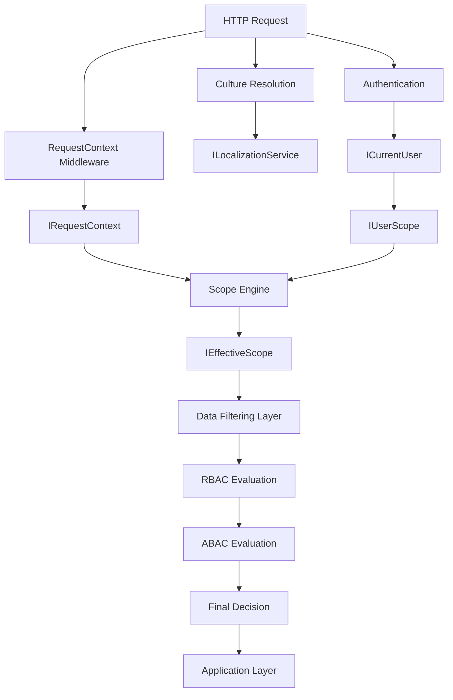
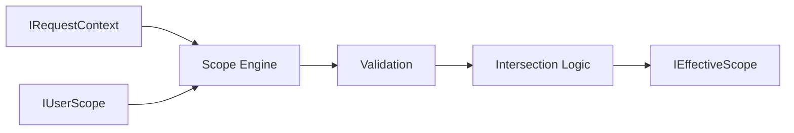
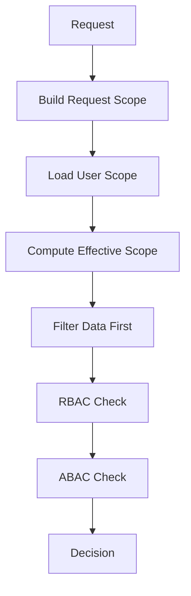
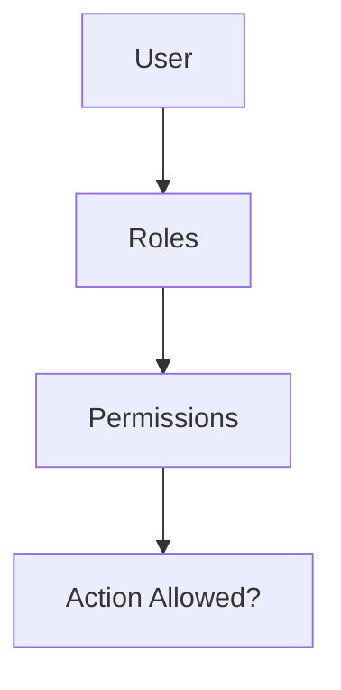
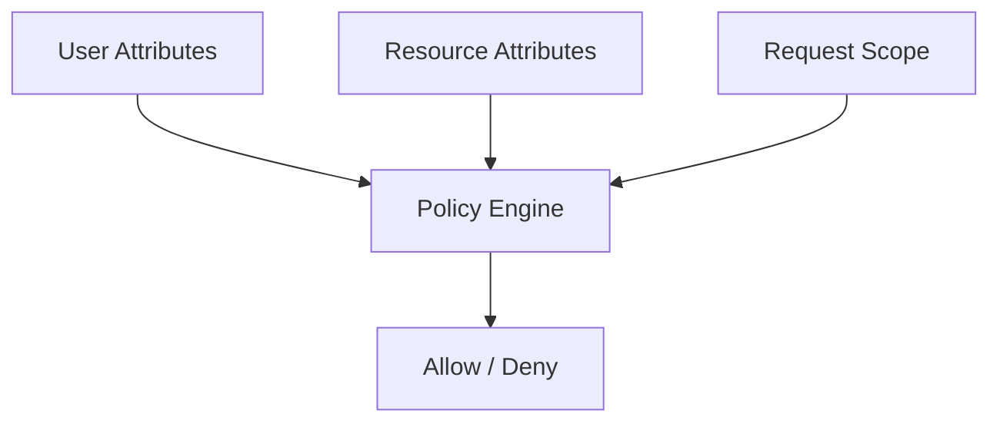
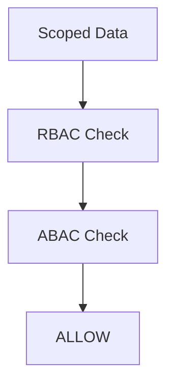
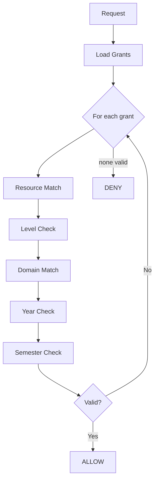
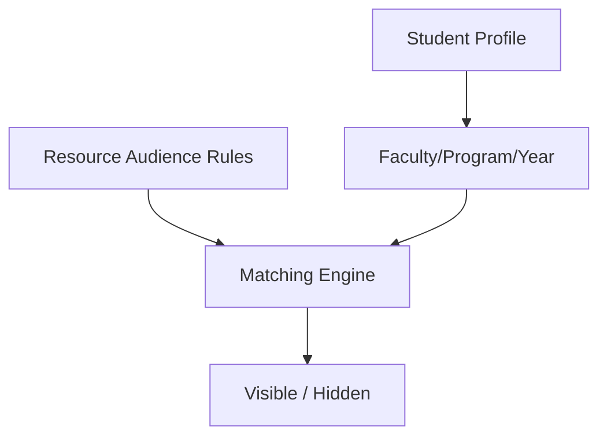
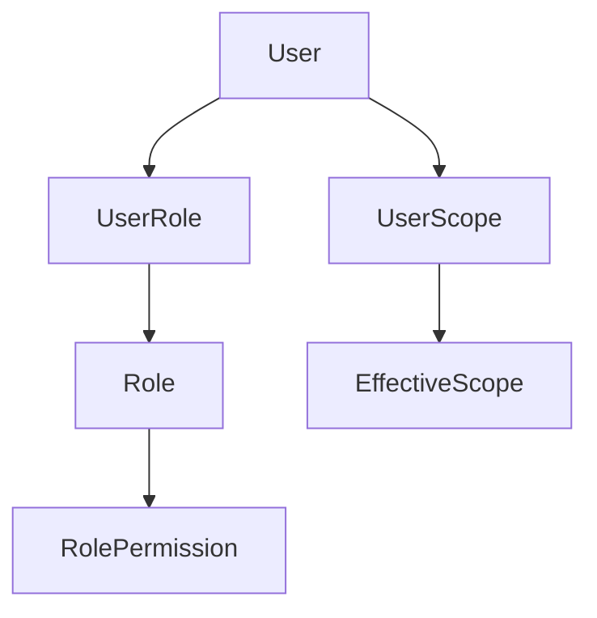
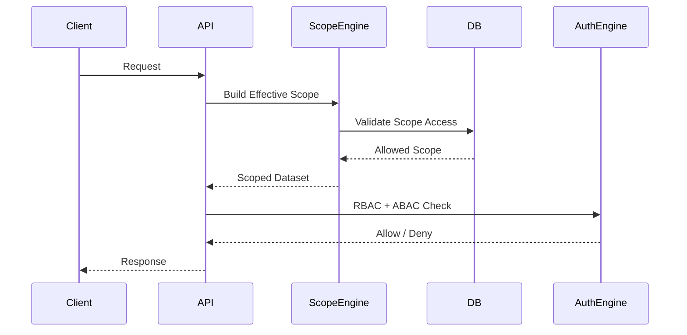

# Authorization Model: Scope-First Hybrid RBAC + ABAC System

This document defines the complete authorization system used in the platform.  
It is a **scope-first security model** where data visibility is determined before permission evaluation.

The system combines:
- Structural + Temporal Scoping (data filtering layer)
- RBAC (role-based action control)
- ABAC (attribute-based constraints)

---

# 1. Core Security Principle

```text
Scope → Filters Data
Permissions → Control Actions

This system NEVER starts from permissions.

Instead:

Scope reduces the visible dataset
Permissions are evaluated inside that dataset
2. High-Level Flow


3. Request Context (Untrusted Input)
Purpose

Represents what the client is requesting.

Structure
public interface IRequestContext
{
    StructuralScope? RequestedStructural { get; }
    TemporalScope? RequestedTemporal { get; }
}
Structural Scope
public class StructuralScope
{
    public Guid? FacultyId { get; set; }
    public Guid? ProgramId { get; set; }
    public Guid? DepartmentId { get; set; }
}
Temporal Scope
public class TemporalScope
{
    public Guid? AcademicYearId { get; set; }
    public Guid? SemesterId { get; set; }
}

4. User Scope (Authorized Boundary)
Purpose

Represents what the user is allowed to access.

public interface IUserScope
{
    IReadOnlyList<Guid> AllowedFacultyIds { get; }
    IReadOnlyList<Guid> AllowedProgramIds { get; }
    IReadOnlyList<Guid> AllowedAcademicYearIds { get; }
    IReadOnlyList<Guid> AllowedSemesterIds { get; }
}

5. Effective Scope (Final Enforced Result)
Purpose

Intersection of:

Requested scope
User allowed scope
public interface IEffectiveScope
{
    StructuralScope Structural { get; }
    TemporalScope Temporal { get; }
}

Scope Resolution Rule
EffectiveScope = Intersection(RequestedScope, UserScope)


6. Scope Resolution Flow


7. Authorization Model (Hybrid RBAC + ABAC)
7.1 Permission Structure (RBAC)
Module.Resource.Action


Example:

Student.Read
Student.Edit
Student.Manage
7.2 Action Levels (Hierarchical)
Level	Action	Meaning
0	None	Hidden
1	View	Read-only
2	Insert	Create allowed
3	Edit + Close	Modify active records
4	Open	Reopen closed records
5	Delete	Full destructive access

Hierarchy:

Manage ⊃ Write ⊃ Read

8. Correct Authorization Order

9. RBAC Layer


RBAC answers:

Can the user perform this action?

10. ABAC Layer

ABAC answers:
Is the action allowed in this context?

11. Final Authorization Decision

12. Permission Evaluation Logic

13. Student Model (Attribute-Based Visibility)

14. Key System Rule
Scope defines visibility
Permissions define actions inside visibility

15. Security Rules
RequestContext is NEVER trusted
UserScope is authority source
EffectiveScope is the ONLY valid scope
RBAC alone is insufficient
ABAC enforces contextual restrictions

16. Data Model Overview


17. Final Execution Pipeline

18. Final Summary
Scope filters data FIRST
Permissions validate actions SECOND
System is hybrid RBAC + ABAC
Authorization is always context-aware
No permission is evaluated outside scope


19. Outcome
This architecture provides:

Strong data isolation per faculty/program/year
Scalable permission system (no explosion of roles)
Clear separation of concerns
Safe multi-dimensional access control
Module-friendly security model
---

# 20. Implementation Naming Conventions

The authorization implementation tracks variables across different scopes and contexts to reach a final decision. To ensure clarity and maintainability, the following naming conventions are strictly used within the `AuthorizationEvaluator` and related authorization components:

| Variable Name | Purpose | Example / Type |
|---------------|---------|----------------|
| `resource` | The name or wildcard identifying the target entity being accessed. | `"Student"` or `"*"` |
| `requiredLevel` | The minimum `ActionLevel` necessary to perform the requested operation. | `ActionLevel.EditClose` |
| `maxGrantedLevel` | The highest `ActionLevel` computed from matching Allow Overrides and Role Permissions. | `ActionLevel.Open` |
| `relevantOverrides` | The subset of `IUserPermissionOverride` that match the current scope and resource (including wildcards `*`). | `List<IUserPermissionOverride>` |
| `denyOverride` | A resolved `OverrideType.Deny` rule whose level implies denial of the `requiredLevel` (`o.Level <= requiredLevel`). | `IUserPermissionOverride?` |
| `allowOverride` | The resolved `OverrideType.Allow` rule with the highest priority/level. | `IUserPermissionOverride?` |
| `matchingAssignments` | The subset of `IUserRoleAssignment` that match the current user, domain, year, and semester. | `List<IUserRoleAssignment>` |
| `decisionSourceType` | Tracks the origin of the authorization decision (Role vs. Override). | `SourceType.UserOverride` or `SourceType.RoleAssignment` |
| `decisionSourceId` | The unique identifier (GUID) of the rule (Role ID or Override ID) that granted access. | `Guid?` |
| `isClosed` | A boolean flag representing the state of the targeted record for ABAC constraints. | `true` (closed record) |
| `isAllowed` | The final computed boolean result before returning an `AuthorizationResult`. | `true` or `false` |

---

# 21. Authorization Test Coverage

The authorization evaluation logic is thoroughly verified through automated tests covering several critical areas of the system. The model guarantees that the following test cases are handled:

### 1. Override Prioritization and Logic
- **Explicit Allow:** Direct `Allow` overrides for a resource grant access and correctly set `SourceType.UserOverride`.
- **Higher Priority Overrides:** If a user has a Role that grants `View`, but an explicit Override grants `EditClose`, the override takes precedence.
- **Role Precedence over Weak Overrides:** If an explicit Override grants `View`, but a Role grants `EditClose`, the Role assignment takes precedence.
- **Hierarchical Deny Logic:** Denying a lower-level action (e.g., `View`) implicitly denies all higher-level actions (e.g., `EditClose`) since permissions follow a strict hierarchy (`Level <= requiredLevel`).
- **Targeted Deny Logic:** Denying a higher-level action (e.g., `EditClose`) does *not* deny lower-level actions (e.g., `View`).

### 2. Scope Constraints
- **Scope Mismatch Denials:** Role assignments and overrides are ignored if the Request Scope (`Domain`, `Year`, `Semester`) does not perfectly match the Authorization Rule Scope.

### 3. Wildcard Resolution
- **Resource Wildcards (`*`):** Role assignments and overrides targeted at the wildcard resource (`*`) successfully match and grant/deny access to specific requested resources.

### 4. Attribute-Based Access Control (ABAC) Constraints
- **Open Record Modifications:** Normal `Insert` and `EditClose` actions proceed as dictated by standard RBAC evaluation.
- **Closed Record Modifications:** Actions attempting to modify closed records (`isClosed = true`) are subjected to stricter evaluations:
  - `Insert` on a closed context requires at least the `Open` action level (Level 4).
  - `EditClose` on a closed record requires at least the `Open` action level (Level 4).
  - `Delete` on a closed record still strictly requires the `Delete` action level (Level 5); having `Open` is insufficient for deletion.
