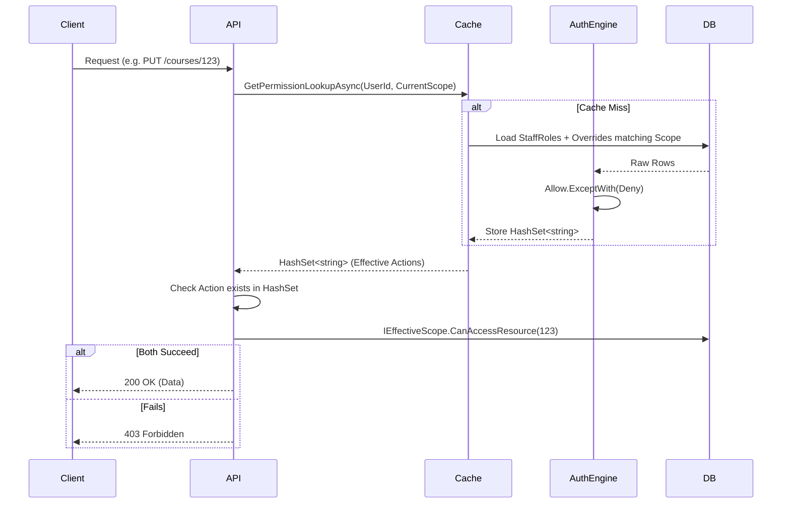

# Authorization Model: Scope-First Hybrid RBAC + ABAC System

This document defines the complete authorization system used in the Capital University Portal platform.
It is a **scope-first security model** where data visibility is determined before permission evaluation, and permissions are heavily contextual.

---

## 1. Core Security Principle

```text
Scope → Filters Data
Permissions → Control Actions

This system NEVER starts from permissions.

Instead:
1. Scope reduces the visible dataset.
2. Permissions are evaluated strictly inside that dataset.
```

## 2. Scope Architecture (Data Filtering)
The system utilizes two primary scoping dimensions to filter data and limit permission authority:

1. **Structural Scope**: Defines the organizational boundary (University -> Faculty -> Department -> Program -> Level).
2. **Temporal Scope**: Defines the chronological boundary (Academic Year -> Semester).

### 2.1 The Request Context
The client request (HTTP context) carries an ambient scope. This is resolved via middleware and injected as `IRequestContext`.
*   If omitted by the client, it defaults to the system's "Current" Academic Year and Semester, and the user's primary Structure Node.

### 2.2 Effective Scope
The intersection of what the user requests and what the user is allowed to see.
*   **Rule**: `EffectiveScope = Intersection(RequestedScope, UserScope)`

---

## 3. Permission Architecture (Action Control)

The system utilizes a canonical string identity for permissions:
`Module.Resource.Action` (e.g., `academics.semesters.EditClose`)

### 3.1 The Manifest System (Single Source of Truth)
Permissions are not arbitrary strings in a database. They are defined in code via `IPermissionManifest`.
*   Each module defines its own manifest (e.g., `CoursesPermissionManifest`).
*   The `PermissionManifestSynchronizer` runs on startup to reconcile these definitions with the database `Modules` and `Resources` tables.

### 3.2 Action Implications (The "Implies" Graph)
Actions follow a hierarchy. The `ManifestActionExpander` manages this graph:
*   **Write-Time Expansion**: When a user is granted `EditClose`, the system automatically expands this and persists `EditClose`, `Insert`, and `View` into the database.
*   **Read-Time Efficiency**: Because implies are expanded at write time, reads (validating a user's permissions) are simple hash-set lookups with no graph-walking required.
*   **Deny Transitivity**: Denying a lower-level action (e.g., `View`) automatically expands backward to deny all higher-level actions (`EditClose`, `Delete`).

---

## 4. User Permission Aggregation

A user's final, effective permissions are an aggregation of multiple sources, strictly scoped.

### 4.1 Sources of Authority
1.  **Roles (`StaffRoles` + `RolePermissions`)**: A user can be assigned multiple roles in multiple scopes. (e.g., "Admin in Faculty of Engineering for Spring 2026").
2.  **Overrides (`StaffPermissions`)**: Individual overrides assigned directly to the user.
    *   **Allow**: Grants a specific permission regardless of roles.
    *   **Deny**: Strips a specific permission, superseding any role grants.

### 4.2 Aggregation Logic (Allow Minus Deny)
The `PermissionManagementService.GetPermissionLookupAsync` method computes the final set:
1.  **Gather Allow**: Union of all actions granted by matching Roles + `Allow` Overrides.
2.  **Gather Deny**: Union of all actions stripped by `Deny` Overrides.
3.  **Result**: `Allow \ Deny` (Set Difference).

---

## 5. Runtime Evaluation & Caching

### 5.1 The Caching Strategy
Permissions are highly cacheable but context-sensitive. The cache key includes the user, their scope, and a global epoch:
`perm_lookup_{epoch}_{userId}_{version}_{year}_{semester}_{structureKey}`

*   **User Version**: Invalidated when the user's specific roles/overrides are modified (`PermissionCacheInvalidator.InvalidateUserAsync`).
*   **Global Epoch**: Invalidated when system-wide roles or manifests change (`PermissionCacheInvalidator.InvalidateAllAsync`).

### 5.2 The Evaluation Flow (HasPermission)
When a controller is decorated with `[HasPermission(PermissionNames.Courses.EditClose)]`:
1.  **Auth Handler**: `PermissionHandler` executes.
2.  **Lookup**: Retrieves the user's flat `HashSet<string>` of allowed actions from the cache (or computes via DB).
3.  **Action Check**: Validates the action exists in the set.
4.  **Scope Check (ABAC)**: If the route contains a resource ID (e.g., `/api/courses/{id}`), it invokes `IEffectiveScope` to guarantee the user's structural/temporal boundary includes that specific entity.

---

## 6. The User Permission Tree UI

The API provides a hierarchical view of a user's effective permissions for management UIs.
*   **Endpoint**: `GET /api/authorization/users/{userId}/permission-tree`
*   **Structure**: Grouped by Module -> Resource -> Action.
*   **Uniqueness**: Duplicate permissions granted by different roles are grouped into a single Action node.
*   **Contextual Provenance**: Each granted Action includes a `Scopes` list (`PermissionScopeDto`), showing exactly *where* (Faculty, Year, etc.) the user holds that permission.

---

## 7. Summary Execution Pipeline

