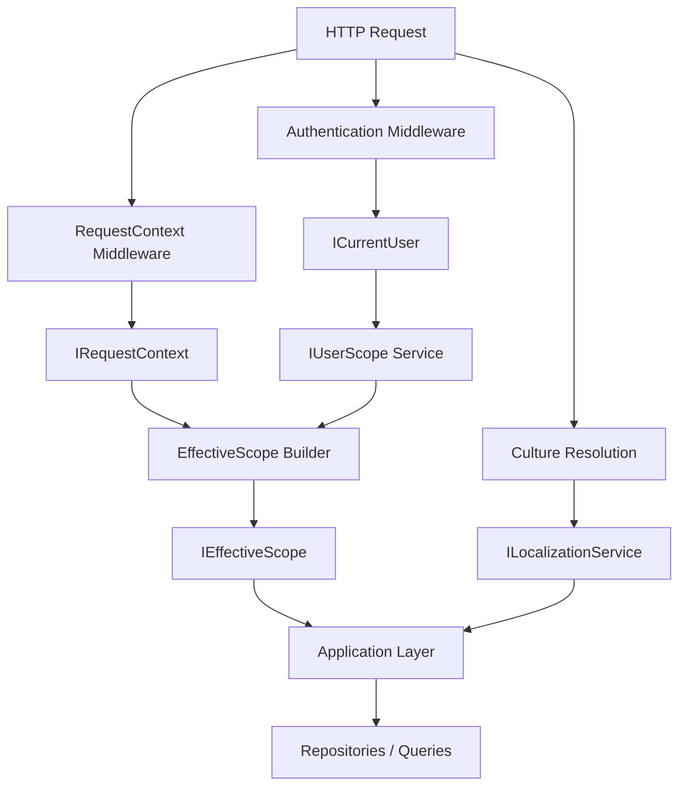
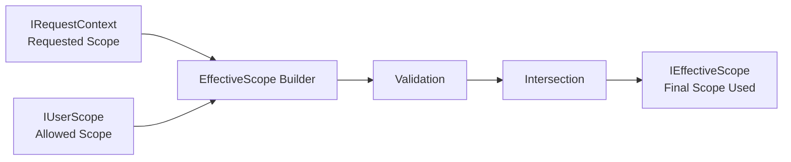
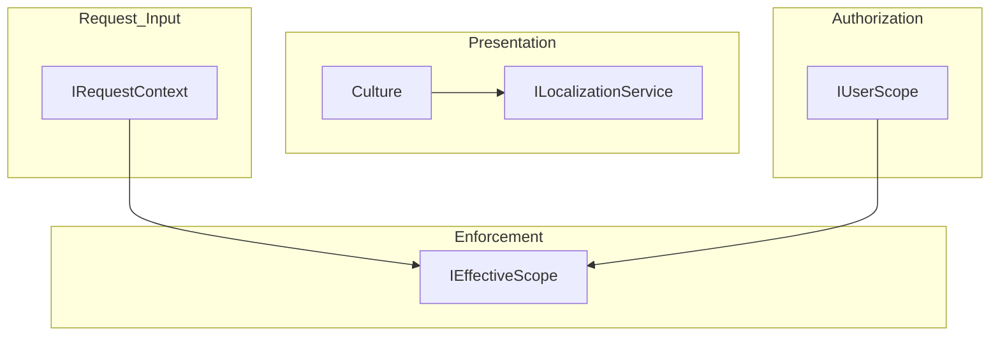
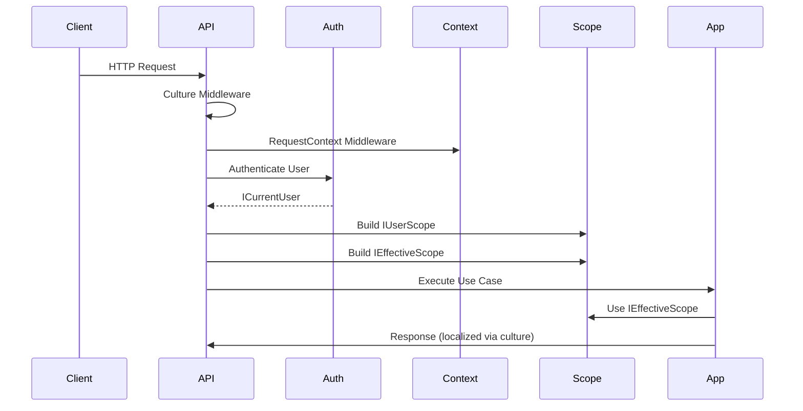

# Request Pipeline: Context, Authorization, and Localization

This document describes how request data, user authorization, and localization interact داخل النظام، مع الحفاظ على فصل واضح بين المسؤوليات.

---

# 1. High-Level Flow

2. Responsibilities
Culture (Localization)
Reads Accept-Language
Sets current culture
Used for:
Translations
Formatting (dates, numbers)
RequestContext
Reads headers:
X-Faculty-Id
X-Program-Id
X-Year-Id
X-Semester-Id
Represents requested scope (untrusted)
Authentication
Identifies user
Provides ICurrentUser
UserScope
Loaded from database
Represents allowed scope (trusted)
EffectiveScope
Combines:
Requested scope (RequestContext)
Allowed scope (UserScope)
Produces:
Validated + enforced scope
Used in:
Application logic
Data filtering
3. Core Enforcement Logic

Rules:
Request headers are not trusted
User scope is source of truth
Effective scope = intersection + validation
4. Separation of Concerns

Key Principles:
Culture ≠ Data Filtering
RequestContext ≠ Authorization
Only EffectiveScope is used in business logic
5. Execution Order

6. Final Model
Request
 ├── Culture            → Presentation (language, formatting)
 ├── Requested Scope    → From headers (untrusted)
 ├── User Scope         → From permissions (trusted)
 └── Effective Scope    → Enforced result (used everywhere)

7. Critical Rules
❌ Never use IRequestContext directly in queries
❌ Never trust headers for authorization
✅ Always use IEffectiveScope in business logic
✅ Keep localization completely separate

8. Outcome

This design ensures:

Clear separation of concerns
Secure data access
Scalable filtering model
Maintainable architecture